# 边缘崩坏 RimHonkai

> 基于《崩坏》世界观的 RimWorld 大型扩展 Mod
> A Honkai-themed large expansion mod for RimWorld

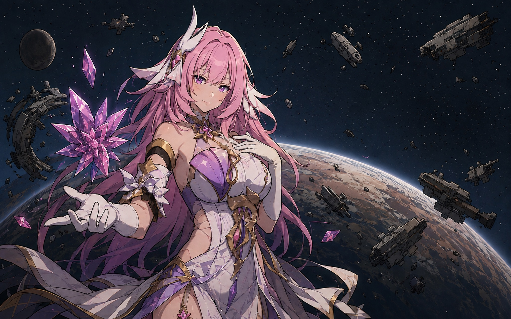

**⚠️ 声明：本项目为「非官方、非商业」的粉丝向同人作品，与 miHoYo（米哈游）无任何隶属或合作关系，仅用于学习与交流，完全免费、不收取任何费用。**
**⚠️ Disclaimer: This is an UNOFFICIAL, NON-COMMERCIAL fan project. It is not affiliated with, sponsored by, or endorsed by miHoYo in any way. Completely free.**

> [!WARNING]
> **当前版本仅用于 Beta 内测。** 本次发布旨在发现并修复错误与 Bug，不保证稳定性、存档兼容性或与其他 Mod 的兼容性，也不保证中途加入现有存档后能够正常运行。请在测试前备份存档；遇到问题请通过 QQ 群或 [GitHub Issues](https://github.com/ALANotFound/RimHonkai-Releases/issues) 反馈。

## 下载 / Download

请前往 [Releases](https://github.com/ALANotFound/RimHonkai-Releases/releases) 下载最新版本：

1. 下载 `RimHonkai_<版本>.zip`
2. 解压得到 `RimHonkai/` 文件夹
3. 将整个 `RimHonkai/` 文件夹放入 RimWorld 的 `Mods/` 目录
4. **必须**订阅 [Harmony](steam://url/CommunityFilePage/2009463077)
5. 游戏内启用本 Mod，加载顺序置于 Harmony 之后

## 关于这个 Mod

《边缘崩坏 RimHonkai》不是简单地在 RimWorld 里加几把武器或几个敌人——它把一整套《崩坏》世界观植入了你的殖民地：

- **崩坏能**既是力量也是侵蚀，你要在攫取力量与抵御侵蚀之间走钢丝；
- 你的小人可以从凡人一步步成长为**律者**，觉醒独一无二的**权能**，甚至登临终焉；
- 崩坏不会安分——律者入侵、终焉之茧的注视、第 N 次崩坏会一次次考验你的据点；
- 从修炼、圣痕、融合战士到神之键，这是一条可以长期投入的养成线。

你的殖民地将不再只是一个求生的聚落，而是一个与崩坏共舞、书写自己「崩坏史」的据点。

## 玩法与系统

### 崩坏能：力量与代价
崩坏能是贯穿始终的核心——它驱动着一切强大能力，同时也会侵蚀环境和小人。你需要一边采集、储存崩坏能，一边对抗侵蚀，在力量与代价之间反复取舍。崩坏兽核心、崩坏能结晶与魂钢，是你攫取、储存与驾驭这股力量的关键资源。

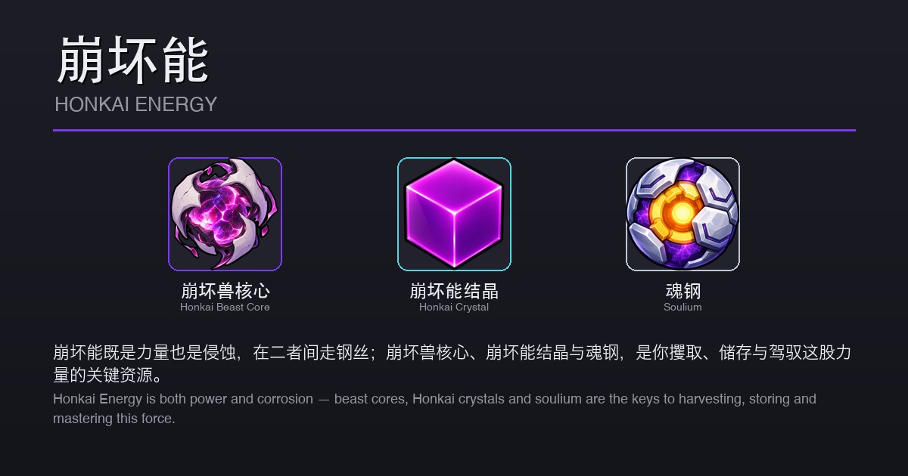

### 律者核心与拟似核心：殖民地的终极战力
培养你的小人成为**律者**，核心从萌芽一路演化到登神，每一阶段都觉醒更强的战斗形态。律者能操纵元素、御空飞行、引发崩坏爆发，是足以扭转战局的顶尖单位。亦可植入**拟似核心**（虚空 / 炎 / 理），无需完整律者觉醒也能继承来源律者的权能；拟似核心可分裂、聚合，是通往律者之路的捷径。

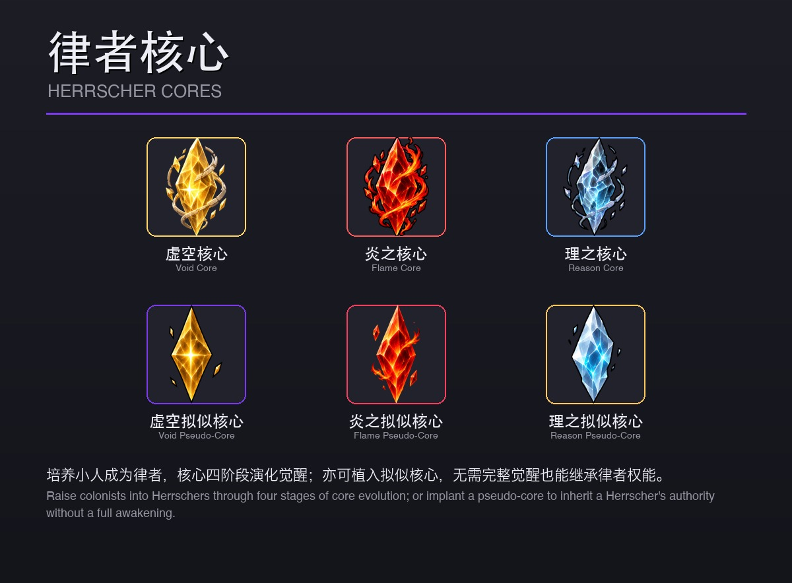

### 律者权能：改变世界的力量
每一位律者都握有独一无二的「**权能**」，这是律者最核心的力量。小人植入拟似核心即可成为**拟似律者**，继承来源律者的权能；权能还可分裂、聚合。

理之权能解析构造万物、空之权能支配空间、炎之权能焚尽战场——改变世界的力量。

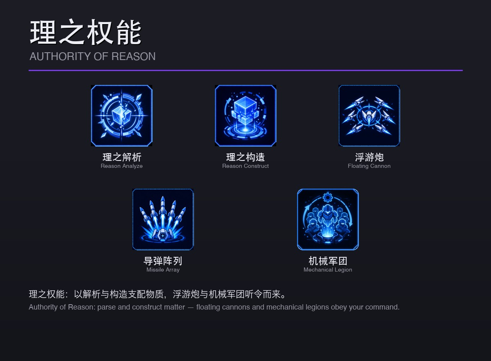
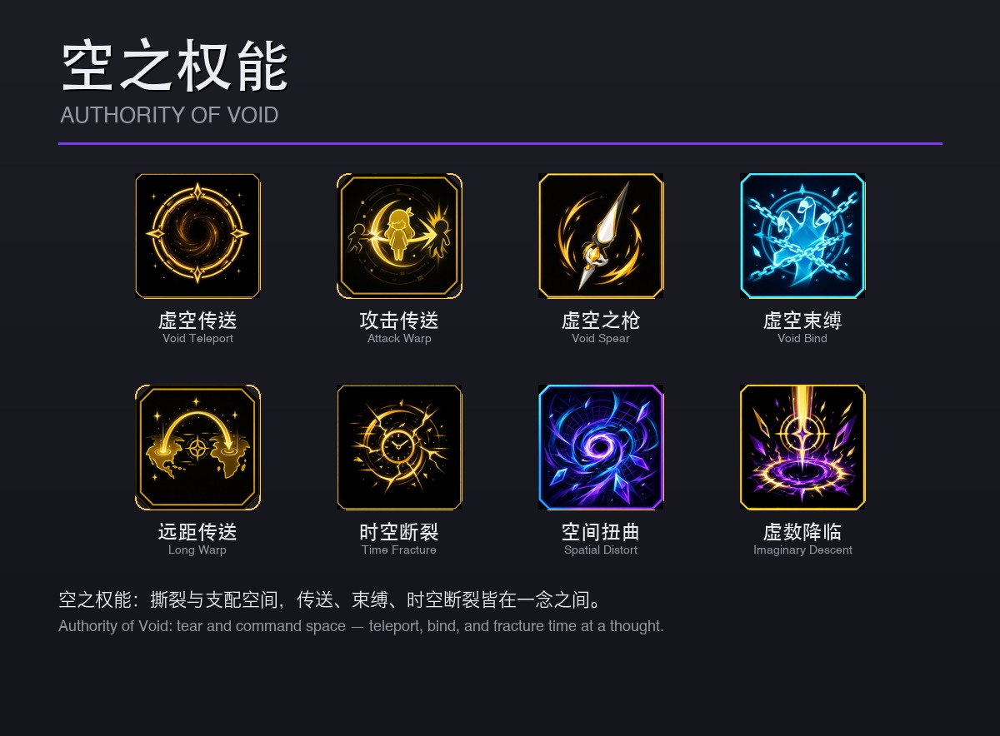
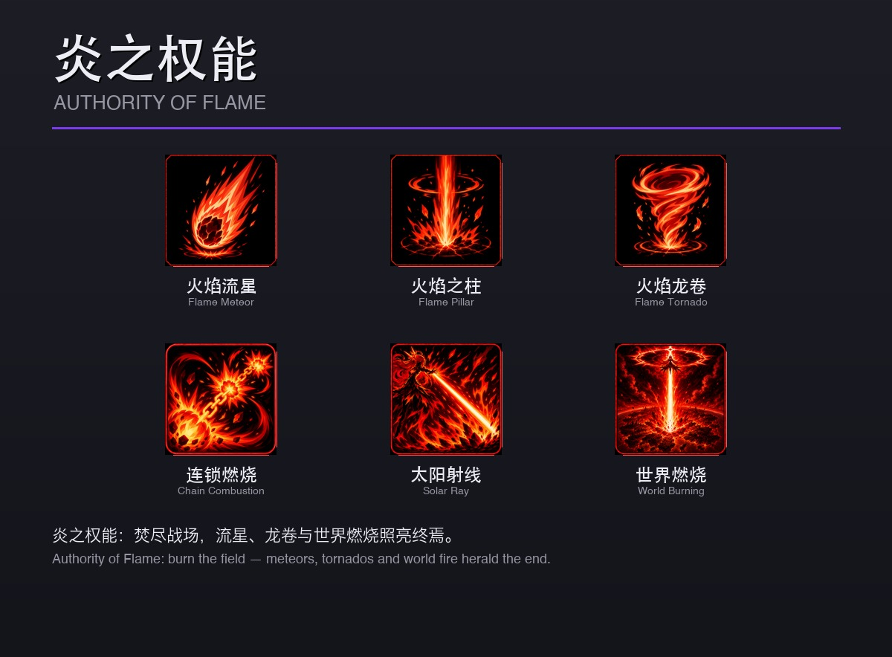

### 建筑与设施：崩坏工业与奇异造物
Mod 新增了大量功能建筑，覆盖能源、生命、空间与算力：

- **崩坏能工业**：崩坏能工作台、崩坏反应炉、大型崩坏反应炉、虚数之井；
- **世界泡工程**：微型世界泡发电机、微型世界泡静置仓、世界泡热交换器；
- **演算中枢**：「普罗米修斯」演算中枢与算力节点；
- **生命工程**：生命信息记录仪、再生仓、克隆素体构筑舱；
- **量子之海**：海渊之眼；
- **修炼**：崩坏能练习点。

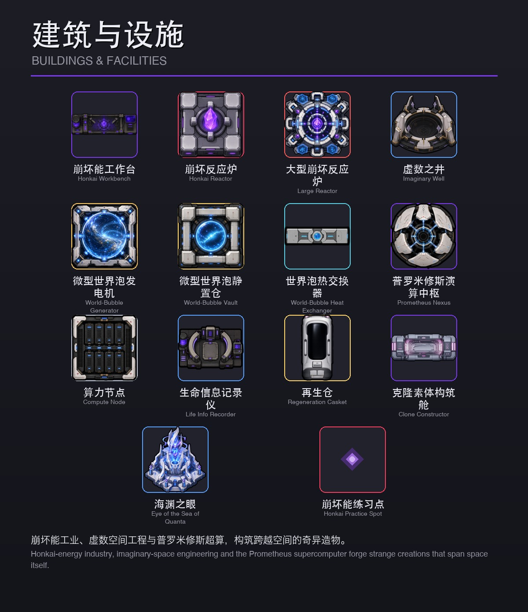

### 融合战士与圣痕：打造你的战士
- 将小人转化为**融合战士**，获得远超常人的战斗体质；
- 为小人刻上多档品质的**圣痕**强化，圣痕还能通过血统遗传给后代（需 Biotech）。

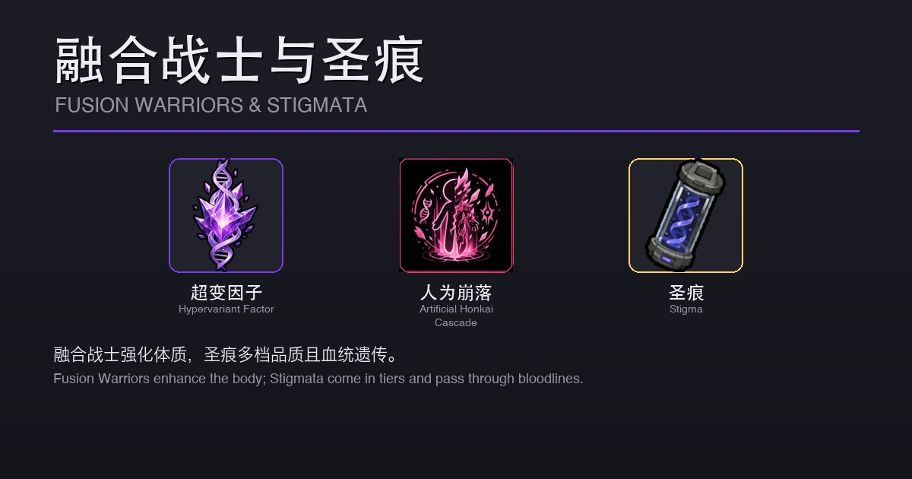

### 神之键：律者核心锻造的终极武装
神之键由**律者核心**锻造而成，可在原型与拟态间切换形态，释放毁天灭地的权能——天火圣裁、虚空万藏、第二神之键·千界一乘皆在此列。

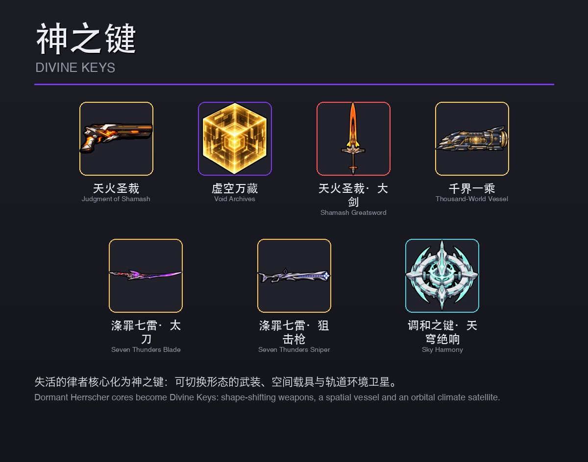

### 武器与装备：从冷兵器到崩坏战甲
从冷兵器的极致，到崩坏战甲的浪漫——你的小人可以全副武装，也可以只披一袭裙装。

#### 武器：淬炼你的战斗风格
收集**樱花吹雪**、**虚空之刃**、**丹影**等传奇武器，亲手淬炼出属于自己的战斗风格。

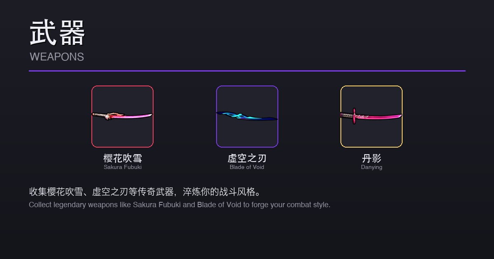

#### 装备：穿上崩坏战甲
穿上白骑士月光战甲与头饰、披上爱莉希雅裙装，让小人化身崩坏战士。

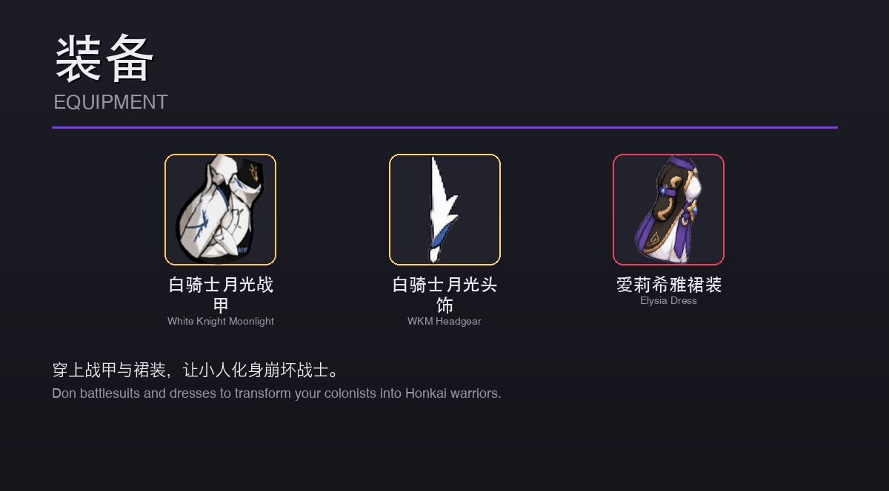

### 崩坏兽：把爪牙变成力量
崩坏兽踏过焦土而来——下位兽群如潮，崩坏帝王与帕凡提的阴影笼罩战场。

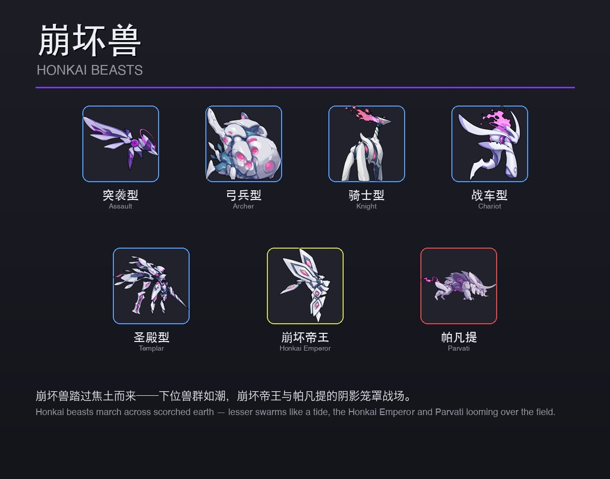

### 大型事件链：文明越强，崩坏越强
当文明的光芒足够耀眼，**终焉之茧便会投下注视**。由此开启贯穿世界地图的大型事件链：第 N 次崩坏爆发，律者在派系据点与殖民地间转移，诸方势力发出求援，而你决定迎战、救援或暂不介入。

事件链开启后，**文明适应**会随财富、人口、研究与崩坏科技持续增强敌人。与苏保持通讯，借「恒沙计划」预警和观测灾难，追寻逐火之蛾遗迹，获取并解析前文明资料，不断解锁新的科技、寻找对抗崩坏的方法，最终尝试跨越终焉。

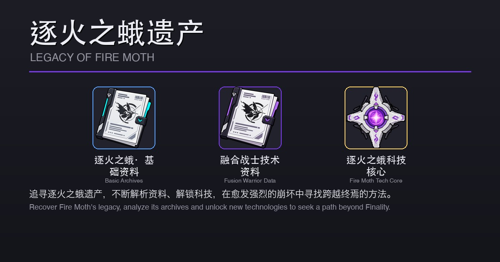

### 派系周旋：多方势力之间
在多方势力间周旋：加入**天命**接取任务、召唤支援、晋升女武神，与**逆熵**、**世界蛇**既博弈也联手，最终共同对抗派系**崩坏意志**。

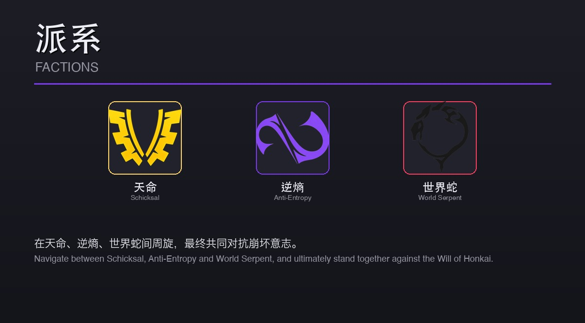

### 故事讲述者：你的「崩坏史」由谁讲述
新增的叙事者会改变你整局游戏的节奏与走向：
- **苏（观察者）**：逐火之蛾的执行者，借第二神之键执行「恒沙计划」，观测无数世界；
- **烧鸡**：“这是一个积极阳光，健康向上的故事。”；
- **终焉·琪亚娜**：她曾亲自面对终焉，如今已获得终焉之茧的认可，成为完整的终焉之律者。她会守护这个世界，让文明拥有成长与选择未来的时间。该讲述者不会随机安排袭击及敌对威胁，适合偏好种田与建设的玩家。

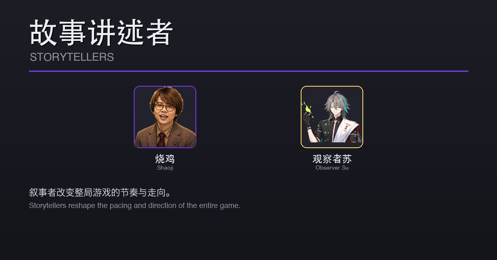

### 虚数空间与世界泡：探索未知
探索**虚数空间**与量子之海中的**世界泡**，借助海渊之眼观测更多世界。

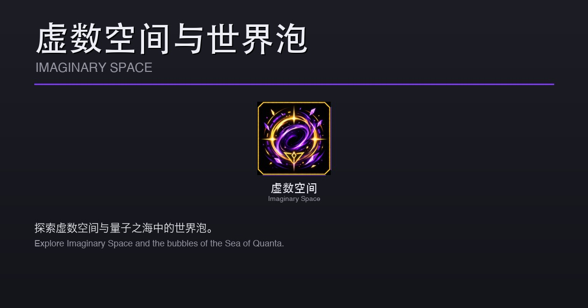

### 崩坏能修炼：一条长期的养成线
通过**修炼**让小人持续成长：点亮修炼路径上的节点，将体内崩坏能化为崩坏兽般的战技与本能，最终走向律者权能。这是一条可以长期投入的养成系统。

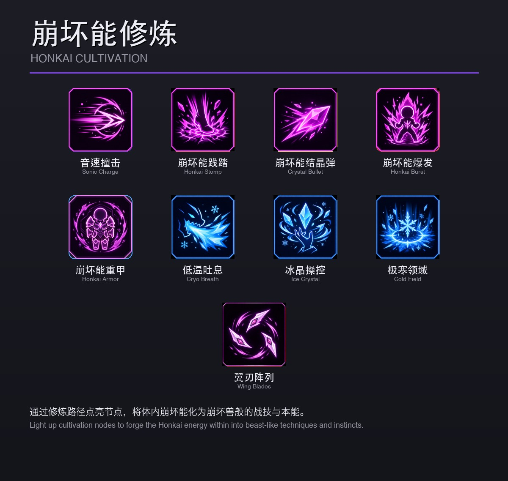

### 抗崩坏科技
以魂钢拟似生命技术构筑对抗侵蚀的防线——本 Mod 提供一套完整的抗崩坏科技体系：

- **植入体**：魂钢拟似生命植入体，全面超越原版超凡义体，大幅提高崩坏能抗性；
- **克隆体**：以魂钢与生命信息构筑人工人形素体；
- **生命信息载体**：记录并承载意识与生命信息的关键媒介；
- **X-10 实验药剂**：高危实验药剂，注射后短时提升体内崩坏能并加速侵蚀，是极端境况下的后备手段。

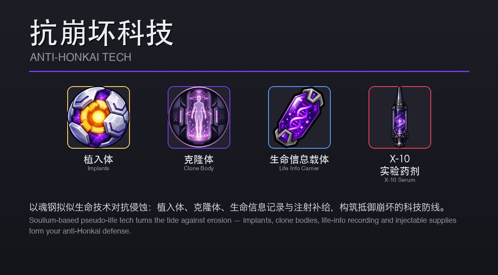

## 安装

1. 通过 Steam 创意工坊订阅，或手动放入 `Mods/`；
2. **必须**订阅 Harmony；
3. 加载顺序置于 Harmony 之后。

## 兼容性

- 支持 RimWorld **1.6**；
- 仅依赖原版 + Harmony，不引入第三方框架（VEF/CE 等）；
- Biotech 为可选依赖（圣痕血脉基因等仅在 Biotech 启用时加载）。

## 未来更新规划

当前 `0.1.0` 只是「边缘崩坏」的起点，更多内容已在路线图中：

- **特殊可招募角色**：如**爱莉希雅**、**白色骑士月光（琪亚娜）**等独有角色，将携带专属能力与剧情登场；
- 更多律者权能、崩坏兽与派系事件将持续扩展。

## 反馈与社区

| 渠道 | 链接 |
| --- | --- |
| QQ 群 | 1041390182 |
| GitHub Issues | [提交问题](https://github.com/ALANotFound/RimHonkai-Releases/issues) |
| B站 | [@山鸟鱼泽](https://b23.tv/JKnbCbV) |
| Steam 创意工坊 | [订阅边缘崩坏 RimHonkai](https://steamcommunity.com/sharedfiles/filedetails/?id=3790844690) |

## 版权与致谢

- 「崩坏 / Honkai」为 miHoYo 注册商标，本作为致敬式同人产物；
- 字体 Orbitron / JetBrains Mono 采用 SIL OFL 许可；
- 详见 [LICENSE](LICENSE)。

## 版本

当前版本：`0.1.0`

---

# English

> A Honkai-themed large expansion mod for RimWorld.

**⚠️ Disclaimer: This is an UNOFFICIAL, NON-COMMERCIAL fan project. It is not affiliated with, sponsored by, or endorsed by miHoYo in any way. Completely free.**

> [!WARNING]
> **The current release is a Beta build intended solely for public testing.** It is provided to identify and fix errors and bugs. Stability, save compatibility, compatibility with other mods, and safe addition to an existing save are not guaranteed. Back up your saves before testing, and report issues through the QQ group or [GitHub Issues](https://github.com/ALANotFound/RimHonkai-Releases/issues).

## Download

Get the latest release from [Releases](https://github.com/ALANotFound/RimHonkai-Releases/releases):

1. Download `RimHonkai_<version>.zip`
2. Extract to a `RimHonkai/` folder
3. Place the whole `RimHonkai/` folder into RimWorld's `Mods/` directory
4. **Must** subscribe to [Harmony](steam://url/CommunityFilePage/2009463077)
5. Enable the mod in-game, load it after Harmony

## About This Mod

RimHonkai doesn't just add a few weapons or enemies to RimWorld — it transplants an entire Honkai universe into your colony:

- **Honkai energy** is both power and erosion; you'll walk a tightrope between seizing strength and resisting corruption;
- Your pawns can grow from ordinary colonists into **Herrschers**, awakening unique **Authorities**, and even approach the Finality;
- The Honkai won't stay idle — Herrscher invasions, the Final Cocoon's gaze, and the N-th Collapse will keep testing your base;
- From cultivation, Stigmata and Fusion Warriors to Divine Keys, this is a long-term progression you can sink into.

Your colony stops being a mere survival settlement and becomes a stronghold dancing with the Honkai, writing its own "Honkai history".

## Gameplay & Systems

### Honkai Energy: Power and Price
Honkai energy is the thread running through everything — it fuels all powerful abilities while also eroding the environment and your pawns. You must gather and store it while fending off erosion, constantly trading power against cost. Beast cores, Honkai Crystals and soulium are the key resources that let you harvest, store and wield this power.

### Herrscher & Pseudo Cores: Your Colony's Ultimate Weapon
Raise your pawns into **Herrschers** — cores evolve from nascent to ascended, each stage awakening stronger combat forms. A Herrscher can manipulate elements, take flight, and unleash Honkai Bursts, becoming a battlefield-changing unit. Or implant a **pseudo-core** (Void / Flame / Reason) to inherit the source Herrscher's authority without a full awakening; pseudo-cores can be split and merged — a shortcut onto the road to a Herrscher.

### Herrscher Authorities: Power to Reshape the World
Every Herrscher wields a unique "**Authority**", the core of its power. Implant a pseudo-core to become a **pseudo-Herrscher** and inherit the source Herrscher's authority; authorities can also be split and merged.

#### Herrscher Authorities
Reason analyzes and builds all things, Void commands space, Flame engulfs the field — the power to reshape the world.

### Buildings & Facilities: Honkai Industry & Wonders
The mod adds a large set of functional buildings spanning energy, life, space, and computation:

- **Honkai industry**: the Honkai energy workbench, Honkai reactor, large Honkai reactor, and imaginary well;
- **World-bubble engineering**: the mini world-bubble generator, mini world-bubble stasis vault, and world-bubble heat exchanger;
- **Computation nexus**: the Prometheus computation nexus and compute nodes;
- **Life engineering**: the life information recorder, regeneration casket, and clone body constructor;
- **Sea of Quanta**: the Eye of the Deep;
- **Cultivation**: the Honkai practice spot.

### Fusion Warriors & Stigmata: Forge Your Fighters
- Transform pawns into **Fusion Warriors** with superhuman combat bodies;
- Engrave multi-tier **Stigmata** to empower pawns; Stigmata can be inherited by bloodline (requires Biotech).

### Divine Keys: Ultimate Arms Forged from Herrscher Cores
Divine Keys are forged from **Herrscher cores**; shift between prototype and mimic forms to unleash world-shaking power — Judgment of Shamash, Void Archives, and the Second Divine Key, the Thousand-World Vessel, are among them.

### Weapons & Equipment: From Cold Steel to Honkai Suits
From the craft of cold steel to the romance of Honkai battlesuits — arm your colonists however you like, from a single blade to a full suit.

#### Weapons: Forge Your Combat Style
Collect legendary weapons like **Sakura Fubuki**, **Blade of Void**, and **Danying**, and temper a combat style that is truly your own.

#### Equipment: Don Honkai Battlesuits
Suit up in the White Knight Moonlight battlesuit and headgear, or drape on the Elysia dress — transform your colonists into Honkai warriors.

### Honkai Beasts: Turn Claws Into Strength
Honkai beasts march across scorched earth — lesser swarms like a tide, the Honkai Emperor and Parvati looming over the field.

### Major Event Chain: The Stronger Civilization Grows, the Stronger Honkai Becomes
When civilization shines brightly enough, **the Final Cocoon turns its gaze upon this world**. A world-spanning event chain begins: the N-th Collapse erupts, Herrschers move between faction settlements and player colonies, powers call for aid, and you choose whether to confront them, intervene, or stand aside.

Once the chain begins, **Civilization Adaptation** strengthens enemies alongside your wealth, population, research, and Honkai technology. Stay in contact with Su, use Project Valuka to anticipate disasters, seek out Fire Moth ruins, analyze archives from the Previous Era, and unlock new technologies—always searching for a way to resist the Honkai and, at last, cross the Finality.

### Faction Politics: Between Great Powers
Navigate between factions: join **Schicksal** to take on missions, call in support and promote Valkyries, both contesting and allying with **Anti-Entropy** and **World Serpent**, and ultimately standing together against the faction of the **Honkai Will**.

### Storytellers: Who Narrates Your Honkai History
New storytellers change the pace and direction of your entire game:
- **Su (the Observer)**: an executor of Valuka, observing countless worlds via the Second Divine Key under the "Project Ember";
- **Shaoji**: another storyteller with a distinct style;
- **Finality · Kiana**: she once faced Finality herself and has now earned the Final Cocoon's recognition as the complete Herrscher of Finality. She protects this world and gives civilization time to grow and choose its future. This storyteller does not schedule random raids or hostile threats, making her suited to farming and construction-focused games.

### Imaginary Space & World Bubbles: Explore the Unknown
Explore the **Imaginary Space** and world bubbles within the Sea of Quanta, observing more worlds through the Eye of the Deep.

### Honkai Cultivation: A Long-term Progression
Grow your pawns through **cultivation**: light up nodes along cultivation paths to forge the Honkai energy within into beast-like techniques and instincts, and ultimately walk toward a Herrscher's authority — a deep, long-term progression system.

### Anti-Honkai Tech
Soulium-based pseudo-life tech builds a defense line against erosion — the mod ships a complete anti-Honkai technology suite:

- **Implants**: soulium pseudo-life implants that surpass vanilla bionics and greatly raise Honkai resistance;
- **Clone bodies**: artificial humanoid bodies forged from soulium and life information;
- **Life info carriers**: the key medium that records and bears consciousness and life information;
- **X-10 Serum**: a hazardous experimental serum that briefly raises internal Honkai energy while accelerating erosion — a last-resort backup.

## Installation

1. Subscribe via Steam Workshop, or install manually into `Mods/`;
2. **Must** subscribe to Harmony;
3. Load after Harmony.

## Compatibility

- Supports RimWorld **1.6**;
- Vanilla + Harmony only, no third-party frameworks (VEF/CE, etc.);
- Biotech is optional (Stigmata bloodline genes load only with Biotech).

## Roadmap

`0.1.0` is only the beginning of RimHonkai; more is already on the roadmap:

- **Special recruitable characters**: unique figures such as **Elysia** and **White Knight Moonlight (Kiana)** will arrive with signature abilities and story beats;
- More Herrscher Authorities, Honkai beasts, and faction events will keep expanding.

## Community

| Channel | Link |
| --- | --- |
| QQ group | 1041390182 |
| GitHub Issues | [Report an issue](https://github.com/ALANotFound/RimHonkai-Releases/issues) |
| Bilibili | [@山鸟鱼泽](https://b23.tv/JKnbCbV) |
| Steam Workshop | (to be filled after release) |

## License & Credits

- "Honkai" is a trademark of miHoYo; this is a tribute fan work;
- Fonts Orbitron / JetBrains Mono are under SIL OFL;
- See [LICENSE](LICENSE).

## Version

Current version: `0.1.0`
